 

  <picture>
    <source media="(prefers-color-scheme: dark)" srcset="dark.svg">
    <source media="(prefers-color-scheme: light)" srcset="light.svg">
    
  </picture>

    

  <!-- Dynamic Typing Title -->
  

   

  <!-- Quick Status Badges -->
  

    
    
    
  

---

### 🚀 Who I Am

I am a **Full-Stack AI Engineer** specializing in bridging the gap between Large Language Models (LLMs) and production-grade, scalable software products. My focus lies in designing robust backend pipelines, multi-platform applications, and responsive, interactive user experiences.

- 🧠 **AI & LLM Systems:** Production RAG pipelines, Vector Search indexing, Model Context Protocol (MCP), and Agentic tool workflows.
- ⚡ **Full-Stack Engineering:** High-performance web apps with **Next.js (App Router)**, **TypeScript**, **Python**, and **Supabase/PostgreSQL**.
- 📱 **Multi-Platform Ecosystems:** Seamless cross-platform experiences across Web, Desktop (Electron), and Mobile.
- 🎯 **Currently Building:** [**Masar X**](https://github.com/fotedev) — an AI-powered study and knowledge orchestration ecosystem.

---

### 🌟 Featured Production Systems

| Project | Tech Highlights | Key Engineering Achievements | Status |
| :--- | :--- | :--- | :---: |
| **[Masar X](https://github.com/fotedev)** | `Next.js` `Supabase` `pgvector` `Electron` `RAG` | Multi-platform study ecosystem featuring semantic PDF search, vector document indexing, and sub-second latency streaming responses. | 🚀 Active |
| **[Interactive SaaS & UI Platform](https://github.com/fotedev)** | `React` `Next.js` `TypeScript` `Framer Motion` `WebSockets` | High-performance interactive platform with 15+ Framer Motion mechanics, real-time WebSocket messaging, dual-theme engine, and role-based admin panel. | ✨ Live |
| **[AI Pipelines & Agentic Tooling](https://github.com/fotedev)** | `Python` `TypeScript` `MCP` `LangChain` `LLM Evals` | Production-ready AI agent pipelines integrating Model Context Protocol (MCP), automated LLM evaluation workflows, and optimized prompt pipelines. | 🛠️ Maintained |
| **[Developer Portfolio](https://github.com/fotedev)** | `Next.js` `Tailwind CSS` `TypeScript` `Vercel` | Modern, responsive developer portfolio engineered for speed, clean UX architecture, and dynamic content delivery. | 🌐 Deployed |

---

### 🛠️ Tech Arsenal

#### 🧠 AI & LLM Systems

  

  
  
  
  

#### 💻 Frontend & UX Engineering

  

#### ⚙️ Backend & Data Infrastructure

  

#### 🧰 DevOps, Tooling & Environment

  

---

### 📊 GitHub Activity & Metrics

  <!-- GitHub Stats & Streak -->
  
  

    

  <!-- Top Languages -->
  

---

### 🕹️ Contribution Journey

  <picture>
    <source media="(prefers-color-scheme: dark)" srcset="https://raw.githubusercontent.com/fotedev/fotedev/output/pacman-contribution-graph-dark.svg">
    <source media="(prefers-color-scheme: light)" srcset="https://raw.githubusercontent.com/fotedev/fotedev/output/pacman-contribution-graph.svg">
    
  </picture>

---

### 🌐 Connect & Collaborate

  
  
  
  
  
  
  

---

  

  <i>⚡ Engineered with passion by <a href="https://github.com/fotedev"><b>Ahmed (FOTE)</b></a></i>

